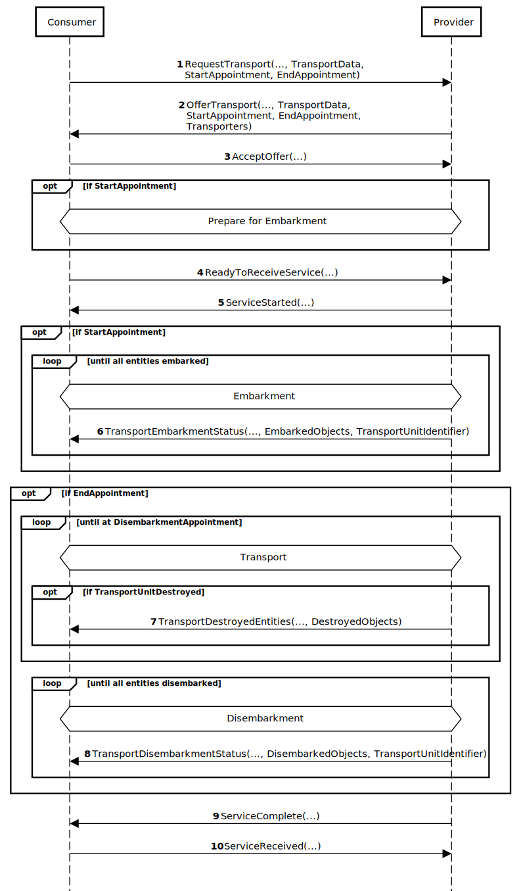

# NETN LOG

The NATO Education and Training Network Logistics Module (NETN LOG).

## Background
Military logistics is the discipline of planning and carrying out the movement and maintenance of military forces including storage, distribution, maintenance and transportation of materiel.

## Description

This module is a specification of how to model logistics services in a federated distributed simulation. 

The specification is based on IEEE 1516 High Level Architecture (HLA) Object Model Template (OMT) and primarily intended to support interoperability in a federated simulation (federation) based on HLA. A Federation Object Model (FOM) Module is used to specify how data is represented and exchanged in the federation. The NETN LOG FOM module is available as a XML file for use in HLA based federations.

## Purpose

NETN LOG provides a common standard interface for negotiation, delivery and acceptance of logistics services between federates modelling different entities involved in the service transaction. E.g simulation of the transport of a unit modelled in another simulator.

## Scope

NETN LOG covers the following services:

* Supply Service offered by a federate capable of simulating transfer of supplies to the consumer.
* Storage Service offered by a federate capable of simulating receiving transfer of supplies from consumer.
* Transport Service offered by a federate capable of simulating loading, transport and/or unloading of non-consumable materiel.
* Repair Service offered by a federate capable of simulating repair of consumer provided non-consumable materiel, e.g platforms.

Examples of use:

* Refuelling of aircraft at an airbase or in the air
* Transport of supplies between facilities
* Repair of damaged platforms in facility or by unit
* Transport of units, platforms, and humans by train, ship, or aircraft   		
# Overview
 
## Materiel
Materiel are classified as:
* Consumable Supplies
    * Ammunition
    * Mines
    * Medical materiel
    * Spare parts
    * NBC Materiel
    * Fuel (Diesel, Gas, Aviation fuel, etc.)
    * Water
    * Food
* Non-consumable Entities
    * Platforms
    * Humans
    * Units
    * Reconnaissance and Artillery systems (Radar)
    * Missile

Transfer of supplies can be requested as a number of items, as cubic meters for liquid bulk goods and in kilograms for solid bulk goods. The type of packaging (fuel in canisters, water in bottles, etc.) is not considered.

## Logistics Service Pattern
All NETN LOG services are based on a Logistics Service Pattern that include negotiation, delivery and acceptance of logistics services. Federates participating in the logistics service transaction are either a service Consumer or a service Provider. 

The pattern defines sequences of service transactions between federates. These transactions are defined in the NETN LOG FOM Module as sub-classes of the `LOG_Service` interaction class. Although the interaction pattern for different types of services may vary slightly, the basic principles and interaction sequences are the same. 


**Figure: Logistics Services Interaction Classes**

The interactions defined for the Logistics Service Pattern are extended by subclassing in order to provide more detail information required for specific logistics services.


<!--```
DIAGRAM GENERATED IN https://sequencediagram.org/
Consumer->Provider: RequestService(RequestTimeOut)

Provider->Consumer: OfferService
Consumer->Provider: AcceptOffer
parallel 
box over Consumer:Get ready for\nreceiving service
box over Provider:Conduct preparations \nfor service delivery
parallel off
Consumer->Provider: ReadyToReceiveService
Provider->Consumer: ServiceStarted
parallel 
box over Consumer:Receive Service
box over Provider:Deliver Service
parallel off
Provider->Consumer: ServiceComplete
Consumer->Provider: ServiceReceived
```-->
**Figure: Phases of the Logistics Service Pattern**

The logistics service pattern is divided into three phases:
**Service Negotiation**: the service is requested, offers received and offers are either accepted or rejected.

1. The consumer initiates negotiation by requesting a service using `RequestService`. If the time, specified in the `RequestTimeOut` parameter, pass without an offer is made, the consumer shall cancel the service using `CancelService`.

2. Offers are sent by provider using `OfferService`. The provider notifies the consumer of its ability to deliver the service using the `IsOffering` attribute and `RequestTimeOut` indicates how long the offer is valid.

3. The consumer accepts an offer using `AcceptOffer` or rejects an offer from a provider using `RejectOffer`.

**Service Delivery**: the consumer indicates that the delivery process can start, and the selected provider starts to deliver, continuing until all the services has been delivered.

4.  The consumer sends a `ReadyToReceiveService` 

5. The `ServiceStarted` is used to indicate that service delivery has started.

_During service delivery, the modelling responsibility of simulated entities involved in the service transaction could change using NETN TMR._

**Service Acceptance**: the provider or consumer indicates the completion of the service delivery and waits for acknowledgement/acceptance from the other part.

6. When service delivery is complete the provider sends a `ServiceComplete` message.

7. When the completed service delivery is accepted the consumer sends a `ServiceReceived`message.

# Transfer of Supplies

Federates can have the capability to provide and/or store supplies. These capabilities can be offered as services to other federates and involve the transfer of materiel from a simulated entity modelled in one federate to antoher entity modelled in another federate.

Supply and storage services are different in terms of flow of materiel between service consumer and provider. 

* Supply Service: Supplies are transferred from the provider to the consumer of the service.
* Storage Services: Supplies are transferred from the consumer to the provider of the service.

The type of supplies is based on the SISO-REF-010 standard. Additional supply types can be defined and documented in federation specific agreements.

The supply and storage service are based on the general NETN Logistics Services Pattern but with specific extensions for supplies.

During service negotiation `Appointment` information is used decide where and when the transfer of the supplies shall take place. The consumer can request a service to be delivered at the `Appointment` but the provider can also change this and propose an alternative `Appointmnet` in the service offer.

The `LoadingDoneByProvider` parameter is used to indicate if the transfer of suplies is performed by the provider (default) or the consumer. This is an agreement between the parties and is specified in the offer.

* If the transfer of supplies is controlled by the provider, then the consumer shall respond with a `ServiceReceived` to any `ServiceComplete` message sent by the provider. The transfer of supplies is considered complete once the `ServiceReceived` message is sent. 
* If the service delivery is controlled by the consumer, then the providing shall respond with a `ServiceComplete` to any `ServiceReceived` message sent by the consumer. Transfer of supplies is considered complete once the `ServiceComplete` is sent. 

Both `SupplyComplete` and `StorageComplete` messages include information on the actual amount of transferred supplies.


<!--```
Consumer->Provider: ...
Consumer->Provider: ReadyToReceiveSupply(SuppliesData)
Provider->Consumer: ServiceStarted
Provider->Consumer: CancelService(Reason)
Provider->Consumer: SupplyComplete(SuppliesData)
Consumer->Provider: ServiceReceived
```-->

**Figure: Service Cancellation**

Early termination of the service request or during delivery is possible and can be initiated by either the consumer or the provider using `CancelService`. 

* If the service is cancelled before service delivery has started, the service transaction is terminated. 
* If the `CancelService` occurs during `ServiceStarted` and `SupplyComplete`, the provider shall inform the consumer of the amount of supplies transferred using `SuppliesData` information in the `SupplyComplete` or `StorageComplete`message. The actual supply amount must be less than or equal to the amount offered.


## Supply Service


<!--```
Consumer->Provider: RequestSupply(SuppliesData, Appointment, LoadingDoneByProvider)
Provider->Consumer: OfferSupply(SuppliesData, Appointment)
Consumer->Provider: AcceptOffer
Consumer->Provider: ReadyToReceiveSupply(SuppliesData)
Provider->Consumer: ServiceStarted
Provider->Consumer: SupplyComplete(SuppliesData)
Consumer->Provider: ServiceReceived
```-->

**Figure: Supply Service**

Supplies are transferred after the offer is accepted and the service delivery has started. 

1. To request supplies, the consumer sends a `RequestSupply` message. The amount and type of requested supplies are provided as `SuppliesData`. The optional `LoadingDoneByProvider`parameter indicates whether the service delivery is controlled by the provider (default) or by the consumer.

2. A `OfferSupply` message is used by potential providers to offer supplies. The offer includes the amount and type of supplies. In the offer the provider can also propose a change to service delivery control.

4. The consumer accepts an offer using `AcceptOffer` or rejects an offer from a provider using `RejectOffer`.

5. The final requested amount of supplies, by type, is specified in the `ReadyToReceiveSupply` message and shall not exceed the amount of supplies, by type, specified in the `OfferSupply` message. 

6. The `ReadyToReceiveSupply` message is used by a consumer to indicate that supply delivery can start.

7. Supplies can be transferred to the service consumer once the `ServiceStarted`message is sent. 

8. A `ServiceComplete` message from the provider and a `ServiceReceived` message from the consumer indicate completion and acceptance of the service delivery. The order in which these messages are send depend on whether the service delivery is controlled by the provider (default) or by the consumer.

## Storage Service


<!--```
Consumer->Provider: RequestStorage(SuppliesData, Appointment, LoadingDoneByProvider)
Provider->Consumer: OfferStorage(SuppliesData, Appointment)
Consumer->Provider: AcceptOffer
Consumer->Provider: ReadyToReceiveStorage(SuppliesData)
Provider->Consumer: ServiceStarted
Provider->Consumer: StorageComplete(SuppliesData)
Consumer->Provider: ServiceReceived
```-->

**Figure: Storage Service**

The storage service os similar to the supply service but the actual transfer of supplies is reveresed and moves from consumer to supplier of the service.

1. To request storage, the consumer sends a `RequestStorage` message. The amount and type of supplies to be stored are provided as `SuppliesData`. An optional `LoadingDoneByProvider`parameter indicates whether the service delivery is controlled by the provider (default) or by the consumer.

2. A `OfferStorage` message is used by potential services providers to make an offer for storing supplies. The offer includes the amount and type that can be stored. In the offer the provider can also propose a change to service delivery control.

3. The consumer accepts an offer using `AcceptOffer` or rejects an offer from a provider using `RejectOffer`.

4. The final requested amount of supplies, by type, is specified in the `ReadyToReceiveStroage` message and shall not exceed the amount of supplies, by type, specified in the `OfferStorage` message. 

5. The `ReadyToReceiveStorage` message is used by a consumer to indicate that supply delivery can start.

6. Supplies can be transferred to the service provider once the `ServiceStarted`message is sent. 

7. A `ServiceComplete` message from the provider and a `ServiceReceived` message from the consumer indicate completion and acceptance of the service delivery. The order in which these messages are send depend on whether the service delivery is controlled by the provider (default) or by the consumer.

# Transport and Repair of Entities

## Repair Service


<!--```
Consumer->Provider: RequestRepair(RepairData, Appointment)
Provider->Consumer: OfferRepair(RepairData, Appointment)
Consumer->Provider: AcceptOffer
Consumer->Provider: ReadyToReceiveRepair(RepairData)
Provider->Consumer: ServiceStarted
Provider->Consumer: RepairComplete(RepairData)
Consumer->Provider: ServiceReceived
```-->
**Figure: Repair Service**

Repair can be performed on non-consumable materiel. E.g. damaged platforms can be moved to a maintenance facility for repair or units capable of providing repair services can move to the location of a damaged platform deliver repair services.

1. To request repair, the consumer sends a `RequestRepair` message. The `RepairData`parameter is a list of materiel and an associated list of the type of repairs for that materiel. If the consumer is an aggregate entity, its damaged equipment must be represented in a platform list.

2. The service provider offers the repair service by sending the `OfferRepair` message. The list of offered repairs may be different from the list of requested repairs.

3. The consumer accepts an offer using `AcceptOffer` or rejects an offer from a provider using `RejectOffer`.

4. The final requested repair is specified in the `ReadyToReceiveRepair` message as `RepairData` and shall be a equal to or a subset of the offered repairs. 

5. The repair service starts when the consumer sends a `ServiceStarted` message. The required effort in making repairs is determined by the provider, based on the degree of damage to the materiel. 

6. The consuming entity shall send a `ServiceReceived` as a response to the `RepairComplete` interaction. The repair is considered as complete once the `ServiceReceived` is sent.

If the `CancelService` is sent either by the Consumer or Provider, before the service has started, no repair of equipment is done. If the `CancelService` occurs during `ServiceStarted` and `RepairComplete`, the provider shall inform the consumer of the amount of repair done using a `RepairComplete` message with `RepairData`.
 

 
## Transport Service

A logistics transport service is used when there is a need to move non-consumable entities such as platforms, units humans or other battlefield objects using means of transportation simulated in another federated system.

The transport service consists of the following phases in which the change of control over the entities differ:

* Embarkment is the process of mounting, loading and storing entities in a truck, convoy, ship etc. Control over the entities is transferred from service consumer to transport service provider.

* Transport is the process of the transport moving entities from a point of departure to its destination. The provider of the transport service have the control over the entities being transported. 

* Disembarkment is the process of dismounting or unloading of entities. Control over materiel is transferred from transport service provider back to the service consumer. 

If required, the change of control over the entities can include a Transfer of Modelling Responsibility (NETN TMR).



<!--```
Consumer->Provider: RequestTransport(TransportData)
Provider->Consumer: OfferTransport(TransportData, OfferType, Transporters)
Consumer->Provider: AcceptOffer
Consumer->Provider: ReadyToReceiveService
Provider->Consumer: ServiceStarted
Provider->Consumer: ServiceComplete
Consumer->Provider: ServiceReceived
```-->
**Figure: Transport Service**

Negotiation, delivery and acceptance of transport service is based on the Logistics Service Pattern:

1. To request a transport, the consumer sends a `RequestTransport` message that include `TransportData` information specifying the entities to transport and the time and location for embarkment and disembarkment.

2. A `OfferTransport` message is used by potential service providers to make an offer for transport. The offer includes information regarding which of the requested entities can be transported and appointment information for embarkment and disembarkment. This offered `TransportData` information can that potentially differ from the requested `TransportData`. The offer also include `Transporters` - a list of entities that will conduct the transport. The `OfferType` information indicates if the offer is positive, negative (no offer) or have some restrictions as specified in the `TransportData` information.

3. The consumer accepts an offer using `AcceptOffer` or rejects an offer from a provider using `RejectOffer`.

4. At the time of embarkment, as specified in the offer `TransportData` information, all entities to be transported must be at the agreed embarkment location. A `ReadyToReceiveService` message is sent by the consumer to initiate the transport service delivery.

5. The delivery of the transport service starts when the provider sends a `ServiceStarted` message. During delivery of the transport services, the provider informs the service consumer about the progress using the following messages (can be sent multiple times):
    * `TransportEmbarkmentStatus` is used to inform the consumer which entities are emarked on which transport.
    * `TransportDisembarkmentStatus` is used to inform the consumer which entities have disemarked from which transport.
    * `TransportDestroyedEntities` is used to inform the consumer about entities that have been lost or destroyed during transport.

6. The consumer sends a `ServiceReceived` as a response to the `ServiceComplete` interaction. The transport service is considered as complete once the `ServiceReceived` is sent.

___During the execution of the transport service, each transporting unit enters a loop where:
    * It publishes a list of embarked units.
    * It publishes a list of disembarked entities. 
If modelling responsibility has been transferred to the Provider; the responsibility of entities specified in this list is restored to the Consumer when disembarked (see Transfer of Modelling Responsibility).___

Entities enbarked on transport shall be considered as inactive during the transportation until disembarked. Federate with modelling responsibility for the embarked entities either set the simulated entity as inactive or updates its location during the transport to correspond to the transporter location. E.g if the embarked entity is represented in the simulation as a `NETN_GroundVehicle` then the `Status` attribute should be set to `Inactive` during the transport. The modelleing responsibility of embarked entities can be transferred using NETN TMR FOM Module.

After disembarkment the transported entities should be active again and their new location should be the location of disembarkment. Any transferred modelling reponsibility can also be returend using NETN TMR FOM Module.

A if a `CancelService` is sent by either consumer or provider, before `ReadyToReceiveService` and `ServiceStarted` has been sent, then the transport service delivery will not start and all involved entities remain in their current state.

If a `CancelService` is sent during delivery of the service but before starting to disembark, all entities already embarked or partially embarked remain on the transport. A new embark, disembark or transport service can be used to continue embarking, disembarking already loaded entities or perform transport with the entities already embarked.

If a `CancelService` is sent during delivery of the service after starting to disembark, all entities not already disembarked or partially disembarked remain on the transport. A new embark, disembark or transport service can be used to complete or continue a new transport activity.
 
### Transport of Aggregate Units

If an `NETN_Aggregate` unit is too large for transport, e.g. size of a unit requires multiple transports to be conducted, then the service consumer may require the unit to be deaggregated into subunits before requesting transport, using e.g. the NETN MRM FOM Module. If multiple transports are required, the consumer can create a temporary `NETN_Aggregate` entity to represent a bridgehead on the disembarkment location. The `Callsign`of the bridgehead should be the same as the aggregate being transported with a "-bh" suffix. 

When all subunits have embarked on transports the `Status` of the original `NETN_Aggregate` unit can be set to `Inactive` until all subunits have disembarked. 

When all subunits have disembarked from their transports the `Status`of the original `NETN_Aggregate` unit can be set to `Active` and the location set to the disembarkment position. Any bridgehead unit can be removed or status set to `Inactive`.

### Damage during Transport

During transport the service provider is responsible to model any damage to the transported entities. E.g. effect of `MunitionDetonation` on a transport. If the transporter vehicle or unit is destroyed then all embarked entities will be destroyed, otherwise damage is individually calculated for each embarked entity. The `TransportDestroyedEntities` message is used to inform the consumer about entities that have been lost or destroyed during transport. The transport service will continue delivery as long as there are vechicles or units able to perform transport. If all means of transport have been destroyed the service is cancelled. 
 
##	Embarkment 

A Consumer makes a request for embarkment with the following data:
* List with units to embark.
* Time and location for embarkment.

A Provider offers a response to the consumer request with the following parameters which may be modified from the originating request:
* List with units that the provider can embark.
* Time and location for embarkment.
* List of units that will execute the embarkment.

An offer is accepted or rejected by the Consumer. The offer is accepted when both service Consumer and Provider are agreeing about the conditions for delivery of the service. To achieve the embarkment service, the units listed for embarkment must be present on time at the embarkment location in order to embark and declare it with the `ReadyToReceiveService` interaction.

The TransportEmbarkmentStatus interaction can be repeated as much as needed, if embarkment needs to be realized in several iterations. During an Embarkment service execution, each transporter enters a loop publishing a list of embarked units. If the modelling responsibility is transferred to the application that provides the service then it shall remain there in this protocol. An Embarkment service is considered as closed:
* When the service Consumer receives a `ServiceComplete` interaction and sends a `ServiceReceived` interaction.
* When a `RejectOffer` is used by the service Consumer.
* When a `CancelService` is used by the service Provider or Consumer.

If an Embarkment service is cancelled:
* During negotiation phase (before service delivery start):
    * The transaction between the service Consumer and Provider is considered as closed without delivery of service.
* During delivery phase (after service start and before service completed):
    * All units already embarked are kept by the service Provider. The service Provider needs a new Request to continue, either to embark remaining units or to disembark the already embarked units.

### Disembarkment 

A Consumer makes a request for disembarkment with the following data:
* List with units to disembark.
* Time and location for disembarkment.

A Provider offers a response to the consumer request with the following parameters which may be modified from the originating request:
* List with units that the provider can disembark.
* Time and location for disembarkment.
* List of units that will execute the disembarkment.

An offer is accepted or rejected by the Consumer. The offer is accepted when both service Consumer and Provider are agreeing about the conditions for delivery of the service. To achieve a Disembarkment service, Consumer shall publish the `ReadyToReceiveService` interaction.

A TransportDisembarkmentStatus interaction can be repeated as much as needed, if disembarkment needs to be realized in several iterations. During a Disembarkment service execution, each transporter enters a loop where it publishes a list of disembarked units. If the modelling responsibility is transferred to the application that provides the service then it shall be returned back to the application that consumed the service.

A Disembarkment service is considered as closed:
* When the service Consumer receives a `ServiceComplete` interaction and issues a `ServiceReceived` interaction.
* When a `RejectOffer` is issued by the service Consumer.
* When a `CancelService` is issued by the service Provider or Consumer.

If a Disembarkment service is cancelled:
* During negotiation phase (before service delivery start):
    * The transaction between the service Consumer and Provider is considered as closed without delivery of service.
* During delivery phase (after service start and before service completed):
    * All embarked units are kept by the service Provider. The service Provider needs a new Request to continue, either to disembark remaining units or to embark the already disembarked units.

Variations:
* Disembarkment protocol can start with a Consumer interaction instead of a Provider one. If a Provider initiates a Disembarkment (planned operation), the protocol execution starts directly at the second step (`OfferService`), without processing the query phase (RequestTansport).	

## Scenario Initialization Phase 

Units can start as embarked units and have a planned disembarkment location. The transporters attribute EmbeddedUnitList shall identify these units with their UniqueId (UUID) which is specified in the scenario (MSDL) file for the initialization of the federation execution. Embarked units shall be published by the consumer during the scenario preparation/initialization phase.

The embarkment phase is assumed to have taken place during the scenario preparation phase, so applications do not need to interact for embarkment. The interaction sequence for the disembarkment service is:
* The Consumer sends a request for disembarkment with units, time and location.
* The Provider offers the service.
* If the offer conditions are OK, it is accepted by the Consumer.
* Consumer directly sends a ReadyToReceive interaction.
* Provider directly sends a `ServiceStarted`.
* Provider sends TransportDisembarkStatus when it arrives at the location.
* Provider sends a `ServiceComplete` when all units have disembarked.
* Consumer sends a `ServiceReceived`.
 


