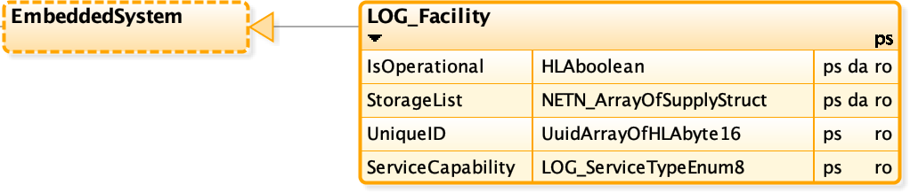
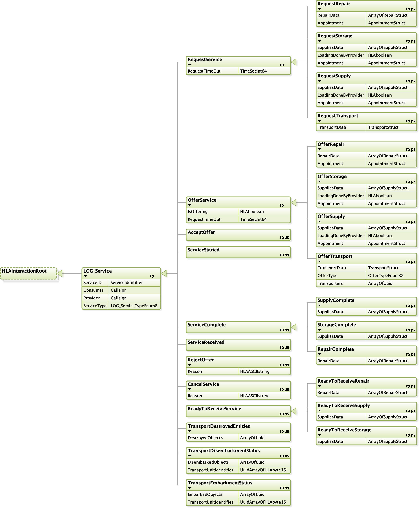
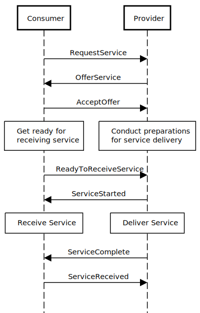
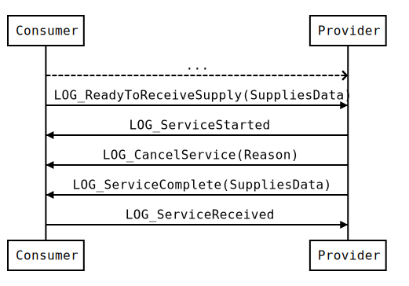
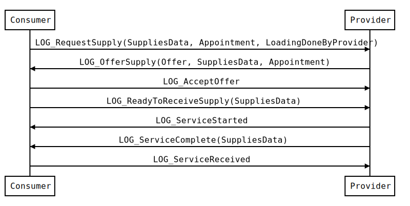
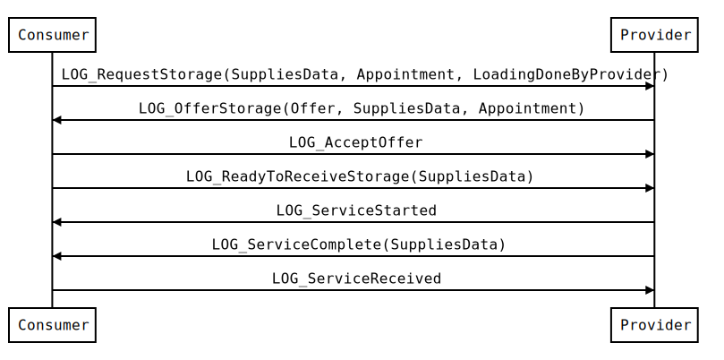
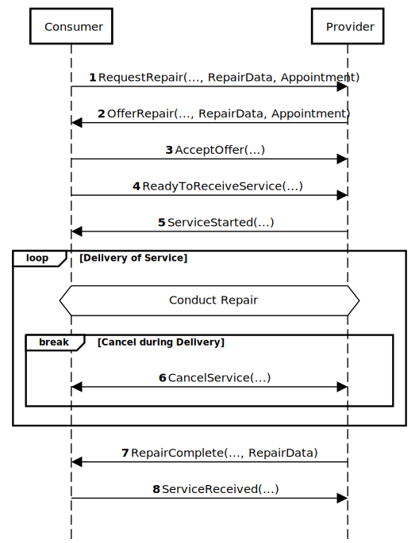

# NETN LOG

The NATO Education and Training Network (NETN) Logistics FOM Module.

## Description
This module is a specification of how to represent logistics services provided to participants in a federated distributed simulation. The specification is based on IEEE 1516 High Level Architecture (HLA) Object Model Template (OMT) and primarily intended to support interoperability in a federated simulation (federation) based on HLA. An HLA OMT based Federation Object Model (FOM) is used to specify types of data and how it is encoded on the network. The NETN FOM FOM module is available as a XML file for use in HLA based federations.

## Purpose

The NETN LOG module provides a common standard interface for negotiation, delivery and acceptance of logistics services where service providers and consumers are represented in different systems in a federated distributed simulation.	

## Scope

The NETN Logistics module covers the following services:

* Supply Service offered by a facility, unit or entity with a capability to provide supplies to the consumer. The supplies are transferred from the provider to the consumer of this service.
* Storage Service offered by a facility, unit or entity with a capability to store supplies. The supplies are transferred from the consumer to the provider of this service.
* Transport Service offered by a facility, unit or entity with a capability to transport non-consumable materiel. Units can embark, be transported and then disembark.
* Repair Service offered by a facility, unit or entity with the capability to repair non-consumables materiel, e.g platforms.

Examples of use:

* Refuelling of aircraft at an airbase or in the air
* Transport of supplies between facilities
* Repair of damaged platforms in facility or by unit
* Transport of units, platforms, and humans by train, ship, or aircraft
* Embarkment and disembarkment of units on platforms
        	
	
# Overview
All NETN Logistics services are based on a Logistics Service Pattern that include negotiation, delivery and acceptance of logistics services. The pattern is described below and is implemented as base classes in the NETN LOG FOM Module. 
 
The NETN LOG FOM module extends RPR-FOM v2.0. Datatypes are re-used and extensions to object classes are defined.

## Facility

The facility concept is central, and all logistics services are provided through facilities. Facilities can be railway stations, storage tanks depot, port, etc. and a facility can also be part of a unit or platform. 
 
The `LOG_Facility` extends the RPR-FOM v2.0 object class `EmbeddedSystem` as a subclass and can therefore be associated with an RPR-FOM 2.0 entity using the `HostObjectIdentifier` and `RelativePosition` attributes. E.g. a facility can be placed on a surface vessel and act as a provider of supply and repair services.



|Attribute|Datatype|Description|
|---|---|---|
|IsOperational|HLAboolean|The operational status of the facility (true = is operational)| 
|StorageList|ArrayOfSupplyStruct|List of the materiel located in the facility.| 
|UniqueID|UuidArrayOfHLAbyte16|The unique identifier for the facility| 
|ServiceCapability|LOG_ServiceTypeEnum8|Describes the service capability of the LOG_Facility instance.| 


## Materiel
Materiel are classified as:
* Consumable Supplies
    * Piece Goods
        * Ammunition
        * Mines
        * Medical materiel
        * Spare parts
    * Bulk Goods
        * Fuel (Diesel, Gas, Aviation fuel, etc.)
        * Water
        * Food
* Non-consumable materiel
    * Platforms
    * Humans
    * Aggregates
    * Reconnaissance and Artillery systems (Radar)
    * Missile

Transfer of supplies can be requested as a number of items, as cubic meters for liquid bulk goods and in kilograms for solid bulk goods. The type of packaging (fuel in canisters, water in bottles, etc.) is not considered.

***Transport of non-consumable materiel*** 

## Logistics Service Pattern

The Logistics Service pattern is used for modelling request, negotiation and delivery of logistics services in a distributed federated simulation. 

Entities participating in the service transaction are considered as either a consumer or a service provider. When modelled in different simulation systems the consumer and provider use HLA interactions defined in the NETN LOG module to model the service transaction. The interaction patterns required for different types of services may vary but the basic principles and interaction class definitions are the same. 



The base classes for the Logistics Service Pattern are extended with subclasses in order to provide more detail information required for specific logistics services.

The logistics service pattern is divided into three phases:



<!--```
DIAGRAM GENERATED IN https://sequencediagram.org/
Consumer->Provider: LOG_RequestService(RequestTimeOut)

Provider->Consumer: LOG_OfferService(IsOffering, RequestTimeOut)
Consumer->Provider: LOG_AcceptOffer
space
Consumer->Provider: LOG_ReadyToReceiveService
Provider->Consumer: LOG_ServiceStarted
Provider->Consumer: LOG_ServiceComplete
space
Consumer->Provider: LOG_ServiceReceived
```-->

**Service Negotiation**: the service is requested, offers received and offers are either accepted or rejected.
1. The consumer initiates negotiation by requesting a service using `LOG_RequestService`. If the time specified in the `RequestTimeOut` parameter pass without an offer is made, the consumer shall cancel the service using `LOG_CancelService`.
2. Offers are sent by provider using `LOG_OfferService`. The provider notifies the consumer of its ability to deliver the service using the `IsOffering` attribute and `RequestTimeOut` indicates how long the offer is valid.
3. The consumer accepts an offer using `LOG_AcceptOffer` or rejects an offer from a provider using `LOG_RejectOffer`.

**Service Delivery**: the consumer indicates that the deliver process can start, and the selected provider starts to deliver, continuing until all the services has been delivered.

4. The `LOG_ServiceStarted` is used to indicate that service delivery has started.
5. The modelling responsibility of the service consumer and/or provider could change during service delivery by using NETN TMR.

**Service Acceptance**: the provider or consumer indicates the completion of the service delivery and waits for acknowledgement/acceptance from the other part.

6. When service delivery is complete a `LOG_ServiceComplete` message is sent and the consumer sends a `LOG_ServiceReceived`message to conclude the service pattern.

# Transfer of Supplies

Facilities can have the capability to supply and/or storage supplies. These capabilities can be offered as supply and storage services. The supply and storage services involves the transfer of materiel from one simulated entity to antoher.

Supply and storage services are different in terms of flow of materiel between service consumer and provider. 

* Supply Service: Supplies are transferred from the provider to the consumer of the service.
* Storage Services: Supplies are transferred from the consumer to the provider of the service.

The type of supplies is based on the SISO-REF-010 standard. Additional supply types can be defined and documented in federation specific agreements.

The supply and storage service are based on the general NETN Logistics Services Pattern but with specific extensions for supplies.

During service negotiation `Appointment` information is used decide where and when the transfer of the supplies shall take place. The consumer can request a service to be delivered at the `Appointment` but the provider can also change this and propose an alternative `Appointmnet` in the service offer.

The `LoadingDoneByProvider` parameter is used to indicate if the transfer of suplies is performed by the provider (default) or the consumer. This is an agreement between the parties and is specified in the offer.

* If the transfer of supplies is controlled by the provider then the consumer shall respond with a `LOG_ServiceReceived` to any `LOG_ServiceComplete` message sent by the provider. The transfer of supplies is considered complete once the `LOG_ServiceReceived` message is sent. 
* If the service delivery is controlled by the consumer then the providing shall respond with a `LOG_ServiceComplete` to any `LOG_ServiceReceived` message sent by the consumer. Transfer of supplies is considered complete once the `LOG_ServiceComplete` is sent. 

Both `LOG_SupplyComplete` and `LOG_StorageComplete` messages include information on the actual amount of transferred supplies.

Early termination of the service request or during delivery is possible and can be initiated by either the consumer or the provider using `LOG_CancelService`. 



<!--```
Consumer->Provider: ...
Consumer->Provider: LOG_ReadyToReceiveSupply(SuppliesData)
Provider->Consumer: LOG_ServiceStarted
Provider->Consumer: LOG_CancelService(Reason)
Provider->Consumer: LOG_SupplyComplete(SuppliesData)
Consumer->Provider: LOG_ServiceReceived
```-->

Figure: Cancellation by the Provider 
* If the service is cancelled before service delivery has started, the service transaction is terminated. 
* If the `LOG_CancelService` occurs during `LOG_ServiceStarted` and `LOG_SupplyComplete`, the provider shall inform the consumer of the amount of supplies transferred using `SuppliesData` information in the  `LOG_SupplyComplete` or `LOG_StorageComplete`message. The actual supply amount must be less than or equal to the amount offered.


## Supply Service

Supplies are transferred after the offer is accepted and the service delivery has started. 



<!--```
Consumer->Provider: LOG_RequestSupply(SuppliesData, Appointment, LoadingDoneByProvider)
Provider->Consumer: LOG_OfferSupply(SuppliesData, Appointment)
Consumer->Provider: LOG_AcceptOffer
Consumer->Provider: LOG_ReadyToReceiveSupply(SuppliesData)
Provider->Consumer: LOG_ServiceStarted
Provider->Consumer: LOG_SupplyComplete(SuppliesData)
Consumer->Provider: LOG_ServiceReceived
```-->

Figure: Provider supplies consumer successfully

1. To request supplies, the consumer sends a `LOG_RequestSupply` message. The amount and type of requested supplies are provided. The optional `LoadingDoneByProvider`parameter indicates whether the service delivery is controlled by the provider (default) or by the consumer.

2. A `LOG_OfferSupply` message is used by potential providers to offer supplies. The offer includes the amount and type of supplies. In the offer the provider can also propose a change to service delivery control.

3. The final requested amount of supplies, by type, is specified in the `LOG_ReadyToReceiveSupply` message and shall not exceed the amount of supplies, by type, specified in the `LOG_OfferSupply` message. 

4. The `LOG_ReadyToReceiveSupply` message is used by a consumer to indicate that supply delivery can start.

5. Supplies can be transferred to the service consumer once the `LOG_ServiceStarted`message is sent. 

6. A `LOG_ServiceComplete` message from the provider and a `LOG_ServiceReceived` message from the consumer indicate completion and acceptance of the service delivery. The order in which these messages are send depend on whether the service delivery is controlled by the provider (default) or by the consumer.

## Storage Service

The storage service os similar to the supply service but the actual transfer of supplies is reveresed and moves from consumer to supplier of the service.


<!--```
Consumer->Provider: LOG_RequestStorage(SuppliesData, Appointment, LoadingDoneByProvider)
Provider->Consumer: LOG_OfferStorage(SuppliesData, Appointment)
Consumer->Provider: LOG_AcceptOffer
Consumer->Provider: LOG_ReadyToReceiveStorage(SuppliesData)
Provider->Consumer: LOG_ServiceStarted
Provider->Consumer: LOG_StorageComplete(SuppliesData)
Consumer->Provider: LOG_ServiceReceived
```-->

1. To request storage, the consumer sends a `LOG_RequestStorage` message. The amount and type of supplies to be stored are provided. An optional `LoadingDoneByProvider`parameter indicates whether the service delivery is controlled by the provider (default) or by the consumer.

2. A `LOG_OfferStorage` message is used by potential services providers to make an offer for storing supplies. The offer includes the amount and type that can be stored. In the offer the provider can also propose a change to service delivery control.

3. The final requested amount of supplies, by type, is specified in the `LOG_ReadyToReceiveStroage` message and shall not exceed the amount of supplies, by type, specified in the `LOG_OfferStorage` message. 

4. The `LOG_ReadyToReceiveStorage` message is used by a consumer to indicate that supply delivery can start.

5. Supplies can be transferred to the service provider once the `LOG_ServiceStarted`message is sent. 

6. A `LOG_ServiceComplete` message from the provider and a `LOG_ServiceReceived` message from the consumer indicate completion and acceptance of the service delivery. The order in which these messages are send depend on whether the service delivery is controlled by the provider (default) or by the consumer.


# Transport and Repair

## Repair Service
Repair service can be performed on non-consumable materiel. E.g. damaged platforms can be moved to a maintenance facility for repair or units with repair capability can move to the damaged platform to provide repair services on location.

The required effort for the repair of damaged materiel is determined by the provider based on the degree of damage to the materiel. If the consumer is an aggregate entity, its damaged equipment must be represented in a platform list to get repaired.



<!--```
Consumer->Provider: LOG_RequestRepair(RepairData, Appointment)
Provider->Consumer: LOG_OfferRepair(RepairData, Appointment)
Consumer->Provider: LOG_AcceptOffer
Consumer->Provider: LOG_ReadyToReceiveRepair(RepairData)
Provider->Consumer: LOG_ServiceStarted
Provider->Consumer: LOG_RepairComplete(RepairData)
Consumer->Provider: LOG_ServiceReceived
```-->

1. The service is initiated with a `LOG_RequestRepair` interaction, sent by a federate with modelling responsibility of damaged equipment (for example damaged platforms). 
2. The service provider offers the repair service by sending the `LOG_OfferRepair` message. 

The `RepairData`parameter in the request interaction is a list of equipment and type of repairs. The list of offered repairs may be different from the list of requested repairs. If the HLA object (equipment to be repaired) has a damaged state, the list of requested repairs could be empty. The providing federate models the efforts to repair a damaged platform.

2. The consuming entity shall send a `LOG_ServiceReceived` as a response to the `RepairComplete` interaction. The repair is considered as complete once the `LOG_ServiceReceived` is sent.

If the `LOG_CancelService` is sent either by the Consumer or Provider, before the service has started, no repair of equipment is done.

If the `LOG_CancelService` occurs during `LOG_ServiceStarted` and `RepairComplete`, the Provider shall inform the Consumer of the amount of repair done using `RepairComplete` parameter `RepairData`. This allows for interruptions due to operational necessity, e.g. death/destruction of either the consumer or provider during repair actions.
 
Figure 9-16: OK Repair.

The service can be cancelled by both the provider and the consumer with the `LOG_CancelService` interaction. If the service is cancelled before service delivery has started, the service transaction is terminated.
 
Figure 9-17: Early Cancellation by the Provider.
 
Figure 9-18: Service Cancelled by the Consumer After Service Started.
 
Figure 9-19: Service Offer Rejected.
 
Figure 9-20: Provider Sends a Negative Offer to the Consumer.

##	Repair Types
The `NETN_RepairTypeEnum16` enumerated data type is defined in the NETN-Repair FOM and identifies a large set of repair types. These enumerations are also defined in the RPR-Enumerations FOM module. DIS does not define the enumerated values as part of the core specification.

In the RPR FOM modules values are defined as a fixed part of some enumerated data types. In order not to violate the modular FOM merging rules, the NETN Logistics FOM modules does not define any extensions to these data types as part of the FOM module. A separate table for adding values to the existing range of enumerations defined in the RPR FOM modules is allowed instead. This table shall be part of any federation specific agreements where extensions to an enumerated data type are required. It is also recommended but not required that any additional enumerated values added to this data type shall be submitted as Change Requests to the SISO RPR-FOM Product Development Group. All existing enumerators in RPR FOM modules and their values are reserved. Additional repair types are documented in the federation specific agreements.

 
## Transport Service

Transport services are used when there are needs to transport non-consumable materiel such as platforms, units or battlefield entities. The providing federate models the transport. The Transport pattern follows the basic NETN Service Consumer-Provider pattern for establishing a service contract and a service delivery. 

Services for Transport include:
* Transport service provided by a facility, a unit or entity with transportation capability of storing and delivering non-consumable materiel.
* Embarkment service provided by a facility, a unit or entity with transportation capability of storing non-consumable materiel.
* Disembarkment service provided by a facility, a unit or entity with transportation capability of delivering non-consumable materiel.

Transport services differ in terms of the flow of units between service consumer and service provider:
* In Disembarkment service, units are transferred from a service provider to a service consumer.
* In Embarkment service, units are transferred from a service consumer to a service provider.
* The Transport service consists of both Embarkment and Disembarkment service.

The Embarkment and Disembarkment services could also be extended to management of facilities; with the capability of delivering and storing non-consumable materiel to/from other facilities, units or battlefield entities. The Transport pattern includes an optional Transfer of Modelling Responsibility mechanism between a service consumer and a service provider (see Transfer of Modelling Responsibility).
 
Figure 9-21: Transport FOM Module.

The following interaction classes are extensions of the NETN Service Consumer-Provider base interactions:
* RequestTransport interaction is used by the consumer to initiate a request of transport to a transport service provider. Units and appointment data are included in the request. The appointment data specifies when and where embarkment and disembarkment shall take place.
* OfferTransport interaction is used by the transport service provider to indicate which of the requested units can be transported. In the offer, the provider can also change the appointment data specified in the request.

During execution of transport services, the service provider shall inform the service consumer about the service progress using the following interactions:
* TransportEmbarkmentStatus interaction is used by the service provider to indicate precisely when units are embarked.
* TransportDisembarkmentStatus interaction is used by a service provider to indicate precisely when units are disembarked.
* TransportDestroyedEntities interaction is used by a service provider to indicate the damage state of units during the transport.

The following NETN Service Consumer-Provider base interactions are also used in the Transport Pattern:
* `LOG_OfferService`.
* `LOG_ReadyToReceiveService`.
* `LOG_ServiceStarted`.
* `LOG_ServiceComplete`.
* `LOG_ServiceReceived`.
* `LOG_CancelService`.
 
Figure 9-22: Transport Service Requested and Delivered.

A Consumer makes a request for transport with the following data in a RequestTransport interaction:
* List with units to transport; and
* Time and location for embarkment and disembarkment.

A Provider offers a response to the consumer request with an OfferTransport interaction with the following parameters which may be modified from the originating request:
* List with units that the provider can transport;
* Time and location for embarkment and disembarkment; and
* List of units that will execute the transport.

An offer is accepted with the interaction `LOG_OfferService` or rejected with the interaction `LOG_RejectOffer` by the Consumer. The offer is accepted when both service Consumer and Provider have agreed about the conditions for delivery of the service. To achieve the transport service, the units listed for transport must be present on time at the embarkment location in order to embark and declare it with the `LOG_ReadyToReceiveService` interaction.

During the execution of the transport service, each transporting unit enters a loop where:
* It publishes a list of embarked units.
* It publishes a list of disembarked entities. If modelling responsibility has been transferred to the Provider; the responsibility of entities specified in this list is restored to the Consumer when disembarked (see Transfer of Modelling Responsibility).

Both TransportEmbarkmentStatus and TransportDisembarkmentStatus interactions can be repeated as much as needed, if transportation needs to be realized in several iterations. Unit management during delivery of services:
* When Embarkment: Federate with modelling responsibility for the embarked units shall set these units as inactive. The unit is no more taken into account in simulation execution.
* During Transport: The modelling responsibility of spatial attributes for the units specified in this list can be transferred to the Provider until disembarkment (see Transfer of Modelling Responsibility) or the consumer shall update the Spatial attribute or IsPartOf and RelativeSpatial attributes.
* When Disembarkment: Federate with modelling responsibility for the disembarked units shall set these units as active and assign their location to the disembarkment location.

A Transport service is considered as closed:
* When the Consumer receives a `LOG_ServiceComplete` interaction and sends a `LOG_ServiceReceived` interaction.
* When a `LOG_RejectOffer` is issued by the service Consumer.
* When a `LOG_CancelService` is issued by either the service Provider or service Consumer.
 
Figure 9-23: Early Cancellation of the Service, here by the Provider. The service transaction is terminated.

If a Transport service is cancelled:
* During negotiation phase (before service delivery start):
    * The transaction between service Consumer and Provider is considered as closed without delivery of service.
* During delivery phase (after service start and before disembarkment has started):
    * All units already embarked or partially embarked are kept by the service Provider. The service Provider needs a new Request to continue, either to embark remaining units or to disembark the already embarked units.
 
* During delivery phase (after disembarkment has started and before complete):
    * All units already disembarked or partially disembarked are kept by the service Consumer. The service Provider needs a Cancellation of the transport service after it is started, and transported units will remain on the transporter.
 
Figure 9-24: Cancellation of the Transport Service after Disembarkment is Started, Units not yet Disembarked will Remain on the Transporter.
 
Figure 9-25: The Consumer Requests a New Transport Service, Disembarkment of Transported Units after a Cancellation of a Previous Transport Service.
 
##	Disaggregation of Units for Transportation 

In the case when a unit is too large for transportation on one transporter, e.g. echelon size does not permit a unit to be transported in a single transportation, the consumer of the service shall disaggregate the large unit in to a number of subunits, which shall be indivisible. The originating unit is set as inactive if it is fully disaggregated according to the definitions in 1278.1a-1998 document, otherwise it shall remain active. All subunits are then included in a transport request, and any offer may then be accepted or rejected.

When a unit is disaggregated for transport these subunits are embarked on more than one transporter or one transporter used repeatedly. At disembarkment, a temporary Bridgehead unit is activated at the disembarkment location, together with disembarked subunits. The bridgehead unit shall be assigned the callsign from the originating aggregate unit with an additional "-bh" to indicate that the unit represents a bridgehead. When all subunits are disembarked the originating unit is aggregated and set as active at the disembarkment location and subunits are then either deleted or set as inactive. The bridgehead is either deleted or set as inactive.

## Warfare Interactions Against Transporter 

Whenever a transport service provider receives warfare interactions (e.g. MunitionDetonation), damage on the transporter is calculated. If the transporter is destroyed then units on board the transporter shall also be destroyed.

If the transporter is not destroyed then damage is assessed against embarked units.

The transport service provider sends a list of destroyed units to the service consumer. The transport service consumer can use this list to update its situation or to cancel a transaction in progress. A transport service provider shall use the TransportDestroyedEntities interaction to define destroyed transported units during the service delivery.

If a transport service consists of one embarkment and one disembarkment event:
* If the transporter is destroyed, the consumer service is cancelled and the transported unit(s) is never reactivated.
else:
* If a transporter is destroyed with transported units on board, transport service continues with remaining transporters until service is completed. Units on destroyed transporter are deleted or set as inactive for the remainder of the federation execution.
 
##	Embarkment Service 

A Consumer makes a request for embarkment with the following data:
* List with units to embark.
* Time and location for embarkment.

A Provider offers a response to the consumer request with the following parameters which may be modified from the originating request:
* List with units that the provider can embark.
* Time and location for embarkment.
* List of units that will execute the embarkment.

An offer is accepted or rejected by the Consumer. The offer is accepted when both service Consumer and Provider are agreeing about the conditions for delivery of the service. To achieve the embarkment service, the units listed for embarkment must be present on time at the embarkment location in order to embark and declare it with the `LOG_ReadyToReceiveService` interaction.

The TransportEmbarkmentStatus interaction can be repeated as much as needed, if embarkment needs to be realized in several iterations. During an Embarkment service execution, each transporter enters a loop publishing a list of embarked units. If the modelling responsibility is transferred to the application that provides the service then it shall remain there in this protocol. An Embarkment service is considered as closed:
* When the service Consumer receives a `LOG_ServiceComplete` interaction and sends a `LOG_ServiceReceived` interaction.
* When a `LOG_RejectOffer` is used by the service Consumer.
* When a `LOG_CancelService` is used by the service Provider or Consumer.

If an Embarkment service is cancelled:
* During negotiation phase (before service delivery start):
    * The transaction between the service Consumer and Provider is considered as closed without delivery of service.
* During delivery phase (after service start and before service completed):
    * All units already embarked are kept by the service Provider. The service Provider needs a new Request to continue, either to embark remaining units or to disembark the already embarked units.

### Disembarkment Service 

A Consumer makes a request for disembarkment with the following data:
* List with units to disembark.
* Time and location for disembarkment.

A Provider offers a response to the consumer request with the following parameters which may be modified from the originating request:
* List with units that the provider can disembark.
* Time and location for disembarkment.
* List of units that will execute the disembarkment.

An offer is accepted or rejected by the Consumer. The offer is accepted when both service Consumer and Provider are agreeing about the conditions for delivery of the service. To achieve a Disembarkment service, Consumer shall publish the `LOG_ReadyToReceiveService` interaction.

A TransportDisembarkmentStatus interaction can be repeated as much as needed, if disembarkment needs to be realized in several iterations. During a Disembarkment service execution, each transporter enters a loop where it publishes a list of disembarked units. If the modelling responsibility is transferred to the application that provides the service then it shall be returned back to the application that consumed the service.

A Disembarkment service is considered as closed:
* When the service Consumer receives a `LOG_ServiceComplete` interaction and issues a `LOG_ServiceReceived` interaction.
* When a `LOG_RejectOffer` is issued by the service Consumer.
* When a `LOG_CancelService` is issued by the service Provider or Consumer.

If a Disembarkment service is cancelled:
* During negotiation phase (before service delivery start):
    * The transaction between the service Consumer and Provider is considered as closed without delivery of service.
* During delivery phase (after service start and before service completed):
    * All embarked units are kept by the service Provider. The service Provider needs a new Request to continue, either to disembark remaining units or to embark the already disembarked units.

Variations:
* Disembarkment protocol can start with a Consumer interaction instead of a Provider one. If a Provider initiates a Disembarkment (planned operation), the protocol execution starts directly at the second step (`LOG_OfferService`), without processing the query phase (RequestTansport).

## Transport Services and Attrition 

The TransportDestroyedEntities interaction can take place at any time between the start of the service (`LOG_ServiceStarted` interaction) and the end of the service (`LOG_ServiceComplete` interaction). Impact on the transport service pattern could be the following example.

Vessel « 1 » and « 2 » are transporters. Some units need to be transported in two rotations on each Vessel. We study the case where Vessel « 1 » is destroyed during its first rotation and Vessel « 2 » is destroyed during its second rotation:

Event	Interaction
Negotiation phase and start of the service	…
First rotation: Vessel 1 and Vessel 2 embark units	Provider send: TransportEmbarkmentStatus (list1, Vessel1) TransportEmbarkmentStatus (list2, Vessel2)
During transport, service Provider receives MunitionDetonation; Vessel 1 is destroyed	Provider send: TransportDestroyedEntities (list1)
Vessel 2 disembark his units	Provider send: TransportDisembarkmentStatus (list2, Vessel2)
Second rotation: Vessel 2 embark units	Provider send: TransportEmbarkmentStatus (list3, Vessel2)
During transport, service Provider receives MunitionDetonation; Vessel 2 is destroyed	Provider send: TransportDestroyedEntities (list3)
End of service or Cancel	

## Scenario Initialization Phase 

Units can start as embarked units and have a planned disembarkment location. The transporters attribute EmbeddedUnitList shall identify these units with their UniqueId (UUID) which is specified in the scenario (MSDL) file for the initialization of the federation execution. Embarked units shall be published by the consumer during the scenario preparation/initialization phase.

The embarkment phase is assumed to have taken place during the scenario preparation phase, so applications do not need to interact for embarkment. The interaction sequence for the disembarkment service is:
* The Consumer sends a request for disembarkment with units, time and location.
* The Provider offers the service.
* If the offer conditions are OK, it is accepted by the Consumer.
* Consumer directly sends a ReadyToReceive interaction.
* Provider directly sends a `LOG_ServiceStarted`.
* Provider sends TransportDisembarkStatus when it arrives at the location.
* Provider sends a `LOG_ServiceComplete` when all units have disembarked.
* Consumer sends a `LOG_ServiceReceived`.
 


