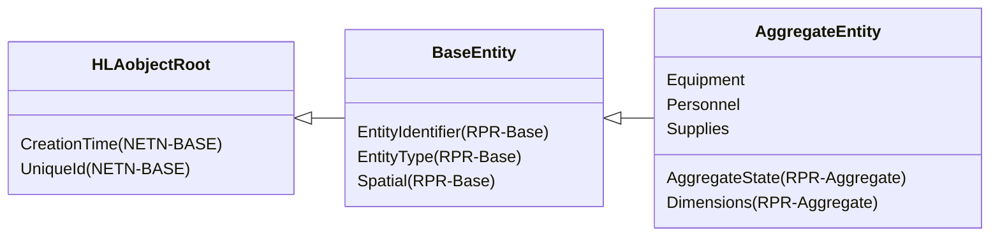
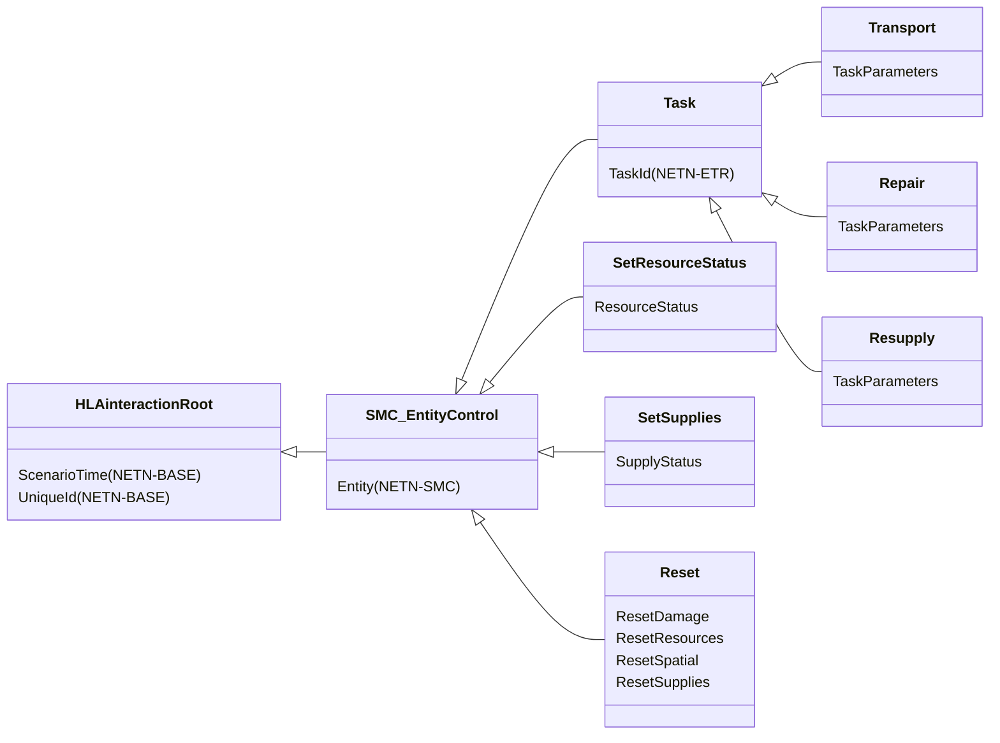

# NETN-LOG
|Version| Date| Dependencies|
|---|---|---|
|3.0|2024-02-12|NETN-BASE|

The NATO Education and Training Network (NETN) Logistics (LOG) Module provides a common standard interface for representing supplies, equipment and personnel when modelled as part of an aggregated entity. The module also includes support for logistics tasks in a federated distributed simulation.

Military logistics is the discipline of planning and carrying out the movement and maintenance of military forces, including storage, distribution, maintenance and transportation of supplies, equipment and personnel.

The NATO Education and Training Network Logistics Module (NETN-LOG) specifies how to model logistics tasks and logistics attributes of aggregated simulation entities in a federated distributed simulation. 
The specification is based on IEEE 1516 High Level Architecture (HLA) Object Model Template (OMT) and supports interoperability in a federated simulation (federation) based on HLA. A Federation Object Model (FOM) Module specifies how data is represented and exchanged in the federation. The NETN-LOG FOM module is available as an XML file for use in HLA-based federations.

The NETN Logistics module covers the following tasks:    
* Resupply, e.g. refuelling of aircraft at an airbase or in the air
* Repair, e.g. repair of damaged platforms in a facility
* Transport, e.g. loading and transport of supplies from a specific pick-up point to an off-loading destination

## Overview 
 
`Supplies`, `Equipment` and `Personnel` are attributes of the `AggregateEntity` object class. 
 
### Transfer of Supplies 
 
OPTIONAL: Use the `Resupply` interaction to transfer supplies from one simulated entity (supplier) to another (receiver). The `Resupply` interaction uses the NETN-ETR tasking pattern, and the NETN-LOG modules extend task datatypes to include resupply task definitions. 
 
The transfer process is modelled by reducing the supplies of the supplier entity and attempting to set the increased supplies of the receiver entity using the `SetSupplies` simulation control interaction. 
 
 

 
 
1. A Tasking Federate sends a `Resupply` task with references to the supplier entity and the receiver entity. 
 
2. The Supplier Entity Federate sends a `TaskStatusUpdate` interaction to indicate the start of the transfer. 
 
3. During the transfer, update the state of the supplier entity continuously or once after the transfer. Use the `SetSupplies` interaction to request an update of supplies for the receiver entity. 
 
4. On completion, the Supplier Entity Federate sends a `TaskStatusUpdate` interaction to indicate task success or failure. 
 
### Repair 
 
OPTIONAL: Use the `Repair` interaction to initiate a task for an entity to repair (RepairingEntity) another entity(ReceiverEntity). The `Repair` interaction uses the NETN-ETR tasking pattern, and the NETN-LOG modules extend task datatypes to include repair task definitions. 
 
Use the `SetResourceStatus` simulation control interaction to model the repair process by attempting to set the receiver entity's resources status. 
 
 

 
 
1. A Tasking Federate sends a `Repair` task referencing the repairing entity and the receiver entity. 
 
2. The Repairing Entity Federate sends a `TaskStatusUpdate` interaction to indicate the start of the transfer. 
 
3. During the repair, use the `SetResourcesStatus` interaction to request an update of a specific type of resource modelled for the receiver entity. 
 
4. On completion, the Repairing Entity Federate sends a `TaskStatusUpdate` interaction to indicate task success or failure. 
 
 
### Transport 
 
A transport task is practical when there is a need to move non-consumable entities such as equipment, personnel or units using transportation simulated in another federate. 
 
The transport task consists of the following phases: 
 
1. Embarkment is mounting, loading and storing simulated entities in, e.g. a truck or an aggregate unit. Embarkment takes place at a designated pick-up point. In case of limitations in the transportation capacity, the simulation entity can not embark. An `AggregatedEntity` representation of the transported entity may require a NETN-MRM disaggregation or divide action before embarking/mounting to fit on the transport. 
 
2. After entity embarkation, the transporting entity moves according to a specified route to its destination. 
 
3. At the destination, disembarkment takes place. 
 
 
 
 

 
 
1. A Tasking Federate sends a `Transport` task referencing the transport entity and the transported entity. Also, provide a route for the transport and an optional appointment to describe the location and time for pick-up. 
 
2. The Transport Entity Federate sends a `TaskStatusUpdate` interaction to indicate the start of the transport task. 
 
3. At the pick-up location, the Transport Entity Federate initiates a NETN-ETR `Mount` task for the transported entity to embark/mount on the transport. 
 
4. The Transported Entity Federate sends a `TaskStatusUpdate` interaction to indicate the start of the embarkation/mounting process. 
 
5. When the embarkation/mounting is complete, the Transported Entity Federate sends a `TaskStatusUpdate` interaction to indicate successful completion. Then, the transport entity conducts its movement according to the transport route. 
 
6. When at the final destination of the transport route, the Transport Entity Federate initiates a NETN-ETR `Dismount` task for the transported entity to disembark/dismount on the transport. 
 
 
7. The Transported Entity Federate sends a `TaskStatusUpdate` interaction to indicate the start of the disembarkation/dismounting process. 
 
8. When the disembarkation/dismounting is complete, the Transported Entity Federate sends a `TaskStatusUpdate` interaction to indicate successful completion. 
 
9. Finally, the Transport Entity Federate sends a `TaskStatusUpdate` to indicate transport task success or failure. 
 
#### Initial Transport State 
 
A scenario can start with some entities already embarked on transports. Use the simulated entity attribute `HostEntity` to identify a potential transporting entity.

## Object Classes

### AggregateEntity

A group of one or more separate objects that operate together as part of an organization. These objects may be discrete, may be other aggregate objects, or may be a mixture of both.

|Attribute|Datatype|Semantics|
|---|---|---|
|Equipment|ArrayOfResourceStatus|Optional. The total amount and status of equipment holdings represented by this entity.|
|Personnel|ArrayOfResourceStatus|Optional. The total amount and status of all personnel holdings modelled by this entity.|
|Supplies|ArrayOfSupplyStatus|Optional. The type and total quantities of supply holdings modelled by this entity.|
|AggregateState (RPR-Aggregate)|AggregateStateEnum8|An indicator of the extent of association of objects form an operating group.| 
|CreationTime (NETN-BASE)|EpochTime|Optional: The time in the scenario when the object is created.| 
|Dimensions (RPR-Aggregate)|DimensionStruct|The size of the area covered by the units in the aggregate.| 
|EntityIdentifier (RPR-Base)|EntityIdentifierStruct|The unique identifier for the entity instance.| 
|EntityType (RPR-Base)|EntityTypeStruct|The category of the entity.| 
|Spatial (RPR-Base)|SpatialVariantStruct|Spatial state stored in one variant record attribute.| 
|UniqueId (NETN-BASE)|UUID|Required. A unique identifier for the object. The Universally Unique Identifier (UUID) is generated or pre-defined.| 

## Interaction Classes

### Transport

Tasks a simulated entity (transporter entity) to transport another simulated entity (transported entity). Successful completion of the task means that (1) the transport and transported entity moves towards a specified pick-up point, (2) the transported entity mounts the transport, (3) the transport moves according to route and at the final waypoint (4) the transported entity dismounts the transport.

|Parameter|Datatype|Semantics|
|---|---|---|
|TaskParameters|TransportTaskStruct|Required: Task parameters|
|Entity (NETN-SMC)|UUID|Required: Reference to a simulation entity for which the control action is intended. Required for all ETR related interactions.| 
|ScenarioTime (NETN-BASE)|EpochTime|Optional: Scenario time when the interaction was sent. Default is interpreted as the receivers scenario time when the interaction is received. Required for all ETR related interactions.| 
|TaskId (NETN-ETR)|UUID|Required. Unique identifier for the task.| 
|UniqueId (NETN-BASE)|UUID|Optional: A unique identifier for the interaction. Required for all ETR related interactions.| 

### Repair

Tasks a simulated entity to perform repair activity on another simulated entity (receiving). Successful completion of the task means that the damage state of the receiving entity is improved.

|Parameter|Datatype|Semantics|
|---|---|---|
|TaskParameters|RepairTaskStruct|Required: Task parameters|
|Entity (NETN-SMC)|UUID|Required: Reference to a simulation entity for which the control action is intended. Required for all ETR related interactions.| 
|ScenarioTime (NETN-BASE)|EpochTime|Optional: Scenario time when the interaction was sent. Default is interpreted as the receivers scenario time when the interaction is received. Required for all ETR related interactions.| 
|TaskId (NETN-ETR)|UUID|Required. Unique identifier for the task.| 
|UniqueId (NETN-BASE)|UUID|Optional: A unique identifier for the interaction. Required for all ETR related interactions.| 

### Resupply

Tasks a simulated entity to resupply another simulated entity (receiving). Successful task completion means that supplies are reduced from the tasked entity and increased at the receiving entity.

|Parameter|Datatype|Semantics|
|---|---|---|
|TaskParameters|ResupplyTaskStruct|Required: Task parameters|
|Entity (NETN-SMC)|UUID|Required: Reference to a simulation entity for which the control action is intended. Required for all ETR related interactions.| 
|ScenarioTime (NETN-BASE)|EpochTime|Optional: Scenario time when the interaction was sent. Default is interpreted as the receivers scenario time when the interaction is received. Required for all ETR related interactions.| 
|TaskId (NETN-ETR)|UUID|Required. Unique identifier for the task.| 
|UniqueId (NETN-BASE)|UUID|Optional: A unique identifier for the interaction. Required for all ETR related interactions.| 

### SetResourceStatus

Instruct federate with the primary responsibility of the specified simulated entity to update the model concerning its Resources. Only applicable to AggregateEntity.

|Parameter|Datatype|Semantics|
|---|---|---|
|ResourceStatus|ResourceStatusStruct|Required: Status of a specific type of resource.|
|Entity (NETN-SMC)|UUID|Required: Reference to a simulation entity for which the control action is intended. Required for all ETR related interactions.| 
|ScenarioTime (NETN-BASE)|EpochTime|Optional: Scenario time when the interaction was sent. Default is interpreted as the receivers scenario time when the interaction is received. Required for all ETR related interactions.| 
|UniqueId (NETN-BASE)|UUID|Optional: A unique identifier for the interaction. Required for all ETR related interactions.| 

### SetSupplies

Instruct federate with the primary responsibility of the specified simulated entity to update the model concerning its Supplies. Only applicable to AggregateEntity.

|Parameter|Datatype|Semantics|
|---|---|---|
|SupplyStatus|SupplyStatusStruct|Required: New quantity of a specific supply.|
|Entity (NETN-SMC)|UUID|Required: Reference to a simulation entity for which the control action is intended. Required for all ETR related interactions.| 
|ScenarioTime (NETN-BASE)|EpochTime|Optional: Scenario time when the interaction was sent. Default is interpreted as the receivers scenario time when the interaction is received. Required for all ETR related interactions.| 
|UniqueId (NETN-BASE)|UUID|Optional: A unique identifier for the interaction. Required for all ETR related interactions.| 

### Reset

Request a reset of aspects of an entity's state to its last initialized value.

|Parameter|Datatype|Semantics|
|---|---|---|
|ResetDamage|HLAboolean|Optional: Indicate if damage state of the entity should be reset to last initialized value. Default is False.|
|ResetResources|HLAboolean|Optional: Indicate if resource state of the entity should be reset to last initialized value. Default is False.|
|ResetSpatial|HLAboolean|Optional: Indicate if spatial state of the entity should be reset to last initialized value. Default is False.|
|ResetSupplies|HLAboolean|Optional: Indicate if supplies state of the entity should be reset to last initialized value. Default is False.|

## Datatypes

Note that only datatypes defined in this FOM Module are listed below. Please refer to FOM Modules on which this module depends for other referenced datatypes.

### Overview
|Name|Semantics|
|---|---|
|AppointmentStruct|Date ; Time and Location of an appointment. When time is set to zero (0), implies as soon as possible.|
|EntityControlActionEnum|Control actions for entities..|
|RepairTaskStruct|Task-specific data for Repair task. If receiving entity is a physical entity, the `ResourceType`, and `QuantityToRepair` fields are ignored.|
|RepairTypeEnum16|System repaired|
|ResupplyTaskStruct|Task-specific data for Resupply task.|
|TaskDefinitionVariantRecord|Variant record for task definition data.|
|TaskProgressVariantRecord|Variant record for task progress data.|
|TransportTaskStruct|Task-specific data for Transport task.|
        
### Enumerated Datatypes
|Name|Representation|Semantics|
|---|---|---|
|EntityControlActionEnum|HLAinteger32BE|Control actions for entities..|
|RepairTypeEnum16|RPRunsignedInteger16BE|System repaired|
        
### Array Datatypes
|Name|Element Datatype|Semantics|
|---|---|---|
        
### Fixed Record Datatypes
|Name|Fields|Semantics|
|---|---|---|
|AppointmentStruct|DateTime, Location|Date ; Time and Location of an appointment. When time is set to zero (0), implies as soon as possible.|
|RepairTaskStruct|ReceivingEntity, ResourceType, DamageState, QuatityToRepair, RepairType|Task-specific data for Repair task. If receiving entity is a physical entity, the `ResourceType`, and `QuantityToRepair` fields are ignored.|
|ResupplyTaskStruct|ReceivingEntity, Supplies|Task-specific data for Resupply task.|
|TransportTaskStruct|TransportedEntity, PickUp, Route|Task-specific data for Transport task.|
        
### Variant Record Datatypes
|Name|Discriminant (Datatype)|Alternatives|Semantics|
|---|---|---|---|
|TaskDefinitionVariantRecord|TaskType (EntityControlActionEnum)||Variant record for task definition data.|
|TaskProgressVariantRecord|TaskType (EntityControlActionEnum)||Variant record for task progress data.|
    